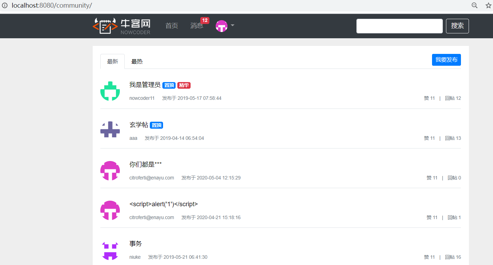
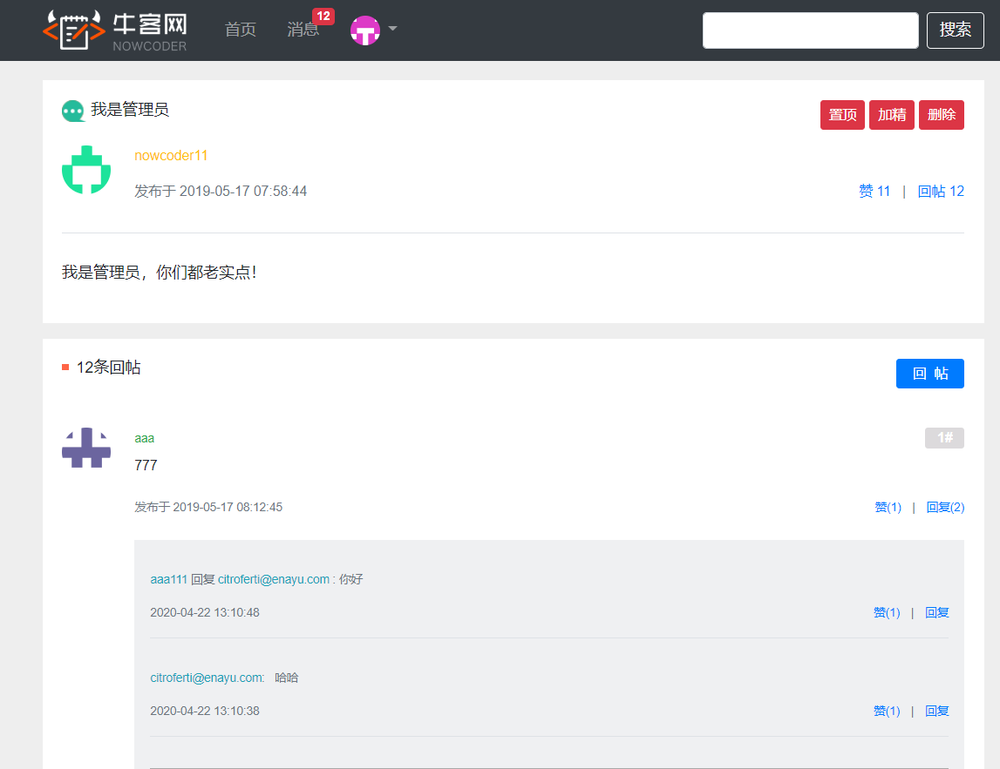

# 仿牛客网的在线社区项目

### 项目概述

基于Spring Boot + MyBatis + MySQL的在线社区项目

- 完成了用户登录注册模块, 使用拦截器实现了统一的登录状态验证
- 完成了帖子发表和评论模块, 基于前缀树实现了敏感词的过滤
- 使用AOP实现了统一的日志记录和异常处理

### 项目模块

- 用户模块: `UserController, UserService, UserMapper`, 涉及的功能包括: 用户注册、邮箱验证、
用户登录、记住登录状态
- 帖子模块: `DiscussPostController, DiscussPostService, DiscussPostMapper`，主要完成帖子的发布
- 评论模块: `CommentController, CommentService, CommentMapper`, 主要完成帖子评论的发布
- `entity`: 实体类
- `form`: 利用`javax.validation`提供的注解进行参数验证
- `interceptor`: 拦截器
    - `UserLoginInterceptor`: 用于判断用户登录状态的拦截器
- `aspect`: AOP切面
    - `ServiceLogAspect`: 统一记录日志
- `util`: 一些工具类
    - `SensitiveWordsFilter`: 基于前缀树的敏感词过滤器
    - `MailClient`: 用于发送邮件的工具类
    - `CommonUtils`
    - `CookieUtils`
- `annotation`:
    - `LoginRequired`: 该注解和`UserLoginInterceptor`搭配用于实现用户登录状态的校验,
    Controller中加上该注解的方法要求用户登录才能访问。
